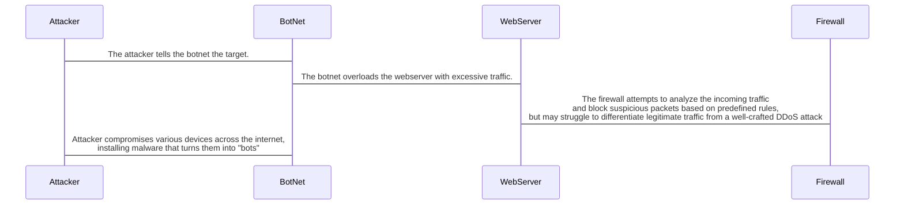

How the DDoS attack happens:

1.  **Infection:**
    
    The attacker compromises various devices across the internet, installing malware that turns them into "bots" within the botnet.
    
2.  **Command and Control:**
    
    The attacker uses a command and control server to send instructions to the botnet, directing all the infected devices to target a specific web server with a flood of traffic.
    
3.  **Traffic Flood:**
    
    The botnet sends a massive amount of requests or packets to the targeted web server, overwhelming its processing power and bandwidth.
    
4.  **Firewall Interaction:**
    
    The firewall will filter out malicious packets and protect the web server from unauthorized access, but with DDoS attacks that can simulate real network traffic it can be difficult for the firewall to even detect the attack.

DDoS attack defense strategies

-   **Monitor traffic**: Use real-time traffic monitoring to identify potential attacks before they cause damage.
    
-   **Rate limiting**: Limit the number of requests a server can accept over a period of time.
    
-   **Web application firewalls (WAFs)**: Protect against application attacks that exploit vulnerabilities in your application.
    
-   **Content delivery networks (CDNs)**: Distribute traffic across multiple servers to absorb traffic spikes.
    
-   **Multi-layered protection**: Protect against volumetric attacks and more sophisticated threats.
    
-   **Regular system updates**: Keep your security systems up to date.
    
-   **Adaptive capacity management**: Improve effectiveness without damaging users.